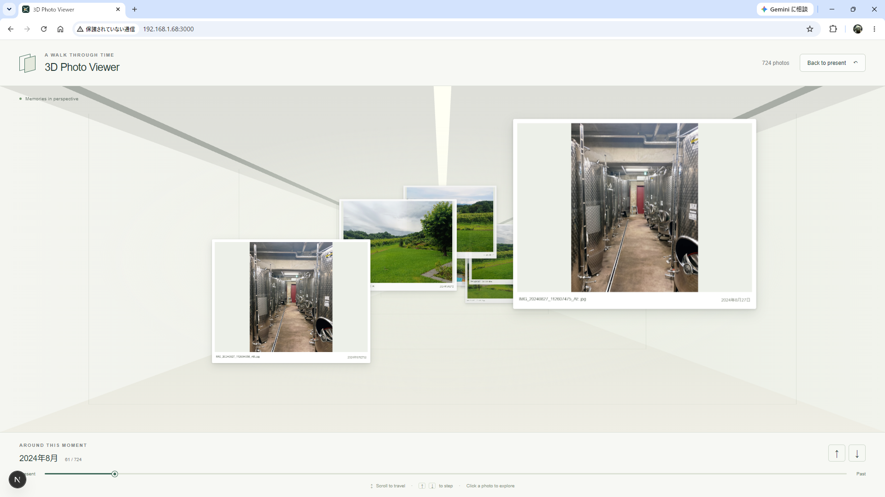

# 3D Photo Viewer

Explore your photo collection as a journey through time. Recent photographs float
near you, while older photographs recede into a 3D corridor. Move through the
timeline with the mouse wheel, keyboard, touch gestures, or timeline slider, and
open any photo in a full-resolution lightbox.

Built with Next.js, React, and TypeScript, the viewer uses CSS 3D transforms and
perspective to create depth. It runs either on AWS (serverless, with sign-in and
uploads) or against a local Node.js backend that preserves capture-date ordering
and cached variants without changing the originals.

## Features

- 3D corridor-style chronological photo browsing, newest to oldest.
- EXIF Date Taken ordering, with modification and creation time fallbacks.
- Continuous mouse-wheel, keyboard, touch, and timeline navigation.
- Deterministic floating photo placement that stays stable during navigation.
- Year markers on the right corridor wall, positioned along the photo timeline.
- Adaptive 320 / 800 / 1600px image resolution with preloading and smooth switching.
- Full-resolution lightbox and an **Open original** action.
- Optional automatic photo import watcher.
- Streamed SHA-256 duplicate detection when destination names collide.
- Collision-safe automatic renaming without overwriting existing photos.
- Original EXIF bytes and modification-time preservation during import.
- Bounded photo DOM rendering for large collections.

## Screenshot



## Tech stack

- **Next.js** — application framework and static frontend export.
- **React** — viewer, controls, and lightbox.
- **TypeScript** — application and importer code.
- **CSS 3D transforms / perspective** — corridor and photo depth.
- **Sharp** — high-quality resized image variants.
- **exifr** — selective EXIF capture-date extraction.
- **Chokidar** — incoming photo directory watcher.
- **Playwright** — browser tests.

## Running on AWS

The application runs serverless on AWS in Tokyo:
- CloudFront serves the static Next.js export, the API, and the photos from a
  single origin.
- Cognito handles invitation-only sign-in through the Hosted UI with PKCE.
- API Gateway and Lambda serve the API, and DynamoDB holds the photo catalog.
- Photos are stored in private S3 buckets and delivered with CloudFront signed
  cookies.

Signed-in users can upload photos from the viewer. A Lambda function then
extracts the capture date, removes duplicates, and generates the 320/800/1600px
variants.

```bash
npm run build:aws          # static export that calls /api and loads /media
cd infra && npx cdk deploy PhotoViewer3D -c siteDir=../out --profile <profile>
```

See the [infrastructure guide](infra/README.md) for the architecture, security
model, inviting users, costs and validation (`cd infra && npm test`).

The frontend chooses its mode at runtime:
- If the deployment publishes `/auth-config.json`, the viewer requires sign-in
  and uses the AWS API.
- Otherwise it runs unauthenticated against the local backend described below,
  exactly as before.

## Quick start: static frontend with a local backend

Requires **Node.js 20.19 or newer**. The project has been verified with Node.js 24.
Have a directory of JPG/JPEG, PNG, or WebP photos available to the server.

```bash
git clone --branch migrate-to-aws-static https://github.com/SoichiroWada/PhotoViewer3D.git
cd PhotoViewer3D
npm install
cp .env.example .env.local
```

Edit `.env.local` and replace the example paths with your own absolute paths:

```dotenv
NEXT_PUBLIC_API_BASE_URL=http://127.0.0.1:4000
NEXT_PUBLIC_PHOTO_BASE_URL=http://127.0.0.1:4000

# Used by the separate local backend, not the static frontend.
PHOTO_DIRECTORY=/path/to/your/photos

# Optional: required only when running the import watcher.
PHOTO_INCOMING_DIRECTORY=/path/to/your/incoming/photos

# Optional: defaults to .photo-cache/ in the application directory.
# Must be outside PHOTO_DIRECTORY.
# PHOTO_CACHE_DIRECTORY=/path/to/your/photo-cache
```

The local backend needs read access to the photo directory and write access to
its cache. Start it in one terminal:

```bash
npm run backend
```

It binds to `0.0.0.0:4000` and serves `/photos` and `/photos/[id]`, with legacy
`/api/photos` aliases. Start the frontend in another terminal:

```bash
npm run dev
```

Open [http://localhost:3000](http://localhost:3000).

`npm run dev` binds to `0.0.0.0`, so the development server can be reached from
other devices on the local network. `npm run start` binds to `127.0.0.1` by
default, serving `out/` through a simple static preview server rather than
`next start`. The default backend URLs are for a browser on the same computer.
Authentication and access controls for public deployment are not included.

To run a production build locally:

```bash
npm run build
npm run start
```

The exported frontend makes requests directly to the configured backend; the
static preview does not proxy API calls. Keep `npm run backend` running for local
photo browsing. The frontend shell can load without a backend, but shows a retry
state until a collection is available.

## Controls

| Input | Action |
| --- | --- |
| Mouse wheel down / up | Travel continuously toward older / newer photos |
| ArrowDown / ArrowUp | Move approximately one photo depth interval |
| Timeline slider | Travel to any position |
| Touch swipe upward | Move toward older photos |
| Click or tap a photo | Open the original image in the lightbox |
| Escape, close button, or lightbox backdrop | Close the lightbox |
| **Open original** | Open the original image in a new browser tab |
| **Back to present** | Return to the newest photo |

Wheel capture applies to the corridor; browser Ctrl+wheel zoom is preserved.
The lightbox suspends camera navigation. Native `<dialog>` contains focus, and
closing it restores focus to the previous control. Reduced-motion preference
removes camera easing; keyboard controls have visible focus states.

## Configuration

### Public frontend settings

| Variable | Purpose |
| --- | --- |
| `NEXT_PUBLIC_API_BASE_URL` | Required HTTP/HTTPS API base; the client appends `/photos` |
| `NEXT_PUBLIC_PHOTO_BASE_URL` | Base for relative image URLs; defaults to the API origin if omitted |

API bases may include a deployment prefix, such as `https://api.example.com/v1`.
Image URLs beginning with `/` resolve from the image origin; other relative URLs
resolve beneath the configured image base path. Absolute image URLs are kept as
provided. Restart development or rebuild the export after changing public settings.

### Local legacy/backend settings

These variables are used only by the separate backend and importer. Restart those
processes after changing them.

| Variable | Default | Purpose |
| --- | --- | --- |
| `PHOTO_API_PORT` | `4000` | Local photo backend port, listening on all network interfaces |
| `PHOTO_API_ALLOWED_ORIGINS` | `http://localhost:3000,http://127.0.0.1:3000` | Comma-separated exact frontend origins permitted by local CORS |
| `PHOTO_DIRECTORY` | Required | Absolute path to the photo collection |
| `PHOTO_INCOMING_DIRECTORY` | Required for the watcher | Absolute path to incoming photos |
| `PHOTO_CACHE_DIRECTORY` | `.photo-cache/` in the application directory | Absolute writable cache path outside the photo collection |
| `PHOTO_IMPORT_CONCURRENCY` | `4` | Maximum concurrent import jobs (1–16) |
| `PHOTO_IMPORT_STABILITY_MS` | `3000` | Required file stability interval (500–60000 ms) |
| `PHOTO_IMPORT_POLL_MS` | `250` | Stability polling interval (50–5000 ms) |

The local backend scans only the photo directory's top level. JPG/JPEG, PNG, and WebP
extensions are case-insensitive; spaces and Unicode filenames are supported.
File symlinks are excluded. Originals are read in place, never copied into
`public/`, and never rewritten by the viewer.

The metadata catalog is cached for five seconds. Reload the page after that
interval to see directory changes, including newly imported photos. Empty or
unreadable directories show a reload or retry action.

## Local legacy/backend: automatic photo import watcher

The optional importer runs as a separate Node.js utility. Configure both
`PHOTO_DIRECTORY` and `PHOTO_INCOMING_DIRECTORY` in `.env.local`, then run this
in a separate terminal from the project directory:

```bash
npm run photo-watch
```

It loads the project's Next.js environment files without starting Next.js.
Missing configured directories are created at startup; the operating-system user
needs read/write permissions. Incoming and final directories must be separate
and must not contain each other, including through directory symlinks.

```text
Incoming directory → wait for stable writes → check collisions → photo directory
```

The watcher processes existing files at startup and newly added or changed files
at the incoming directory's top level. It supports the same image extensions as
the viewer. Unsupported files remain in incoming; file symlinks and subdirectories
are excluded.

A successful import removes the incoming file after publishing the complete
photo. A confirmed exact duplicate is also removed from incoming. If a name
already exists with different bytes, the importer uses `name_1.JPG`, `name_2.JPG`,
and so on. Failed imports retain their incoming files, and other jobs continue.
EXIF bytes, modification time, pre-read access time, and ordinary permission bits
are preserved; creation time generally cannot be restored on Linux.

For a reliable handoff, copy into incoming with an unsupported temporary extension
such as `.partial`, close the completed file, then rename it to a supported image
extension. A stability interval cannot prove that a paused writer has finished.
Do not resume writing or replace the same path after handing it to the importer.

Ctrl+C stops watching, cancels outstanding stability waits, finishes active copy
operations safely, and leaves queued sources for the next start. Refresh the
viewer after its five-second catalog cache expires to see imported photos.

## Development and testing

```bash
npm run test
npm run typecheck
npm run build
```

Browser tests serve the static export and start a separate backend with temporary
generated photos; your configured photo directory and cache are not used. Build
with the fixture endpoints, then install Chromium and run Playwright:

```bash
NEXT_PUBLIC_API_BASE_URL=http://127.0.0.1:4000 NEXT_PUBLIC_PHOTO_BASE_URL=http://127.0.0.1:4000 npm run build
npx playwright install chromium
npm run test:browser
```

Playwright starts `npm run start` for the exported files and an isolated fixture
backend on port 4000. Outside CI, it may reuse an existing frontend server. Set
`TEST_BASE_URL` to use a running static frontend at another address. Set
`TEST_API_BASE_URL` (and optionally `TEST_PHOTO_BASE_URL`) to use an already-running
external backend instead of fixture generation; these URLs must match the values
used to build the frontend. Alternatively, set `CHROME_PATH` to an installed
Chrome executable instead of installing Playwright's Chromium.

When using your own backend for browser tests, its collection needs at least eight
decodable photos, with the first and seventh originals wider than 1600px after
orientation. Mock catalog cases verify bounded rendering with 10,000 photos.
Static shell tests also verify cross-origin metadata requests, unavailable-backend
handling, and the absence of same-origin photo API routes.

Automated tests cover date priority and malformed EXIF, metadata/cache
invalidation, sorting, supported files and symlink rejection, image variants and
ETags, positioning and camera bounds, wheel movement and passing, lightbox focus,
responsive layout, resolution switching, and year markers. Importer tests use
temporary directories for real imports, live watching, streamed hashes, collision
races, timestamp/EXIF preservation, cleanup, and source-change protection.

## Implementation details

### Local backend photo dates and API

The following filesystem and metadata logic runs in the separate local Node.js
backend. The frontend imports only the browser-safe client in
`src/lib/api/photoApi.ts`, which validates responses, resolves image URLs, and
reports configuration or API errors through the existing retry UI. It never
falls back to a same-origin Next.js API when configuration is missing.

The public model remains:

```ts
type Photo = {
  id: string;
  filename: string;
  thumbnailUrl: string;
  originalUrl: string;
  takenAt: string;
};
```

`GET /photos` (also available as `/api/photos` locally) returns photos sorted newest to oldest by the selected ISO
`takenAt`, with filename order as a stable tie-breaker. Date selection tries:

1. Valid EXIF `DateTimeOriginal`, then EXIF `CreateDate`.
2. Filesystem modification time (`stat.mtime`).
3. Usable filesystem creation time (`stat.birthtime`).

Missing, malformed, or invalid metadata falls back per photo without failing the
collection. Unsupported or epoch birthtime is rejected. If every date is invalid,
the photo remains with an epoch placeholder and `source: null` in diagnostics.

exifr parses only capture-date and associated timezone-offset tags. JPEGs use
bounded chunked reads. PNG/WebP readers skip pixel payloads and pass only their
EXIF chunk to exifr, with defensive limits of 320 KiB and 512 container headers.
Unchanged date results and pending reads are shared in a cache keyed by path,
device/inode, size, mtime, ctime, and birthtime; removed entries are pruned.
Filesystem scanning processes batches of up to 32 files.

EXIF dates with a usable offset use it; dates without one use the server's local
timezone. Set the server's `TZ` environment variable if a specific timezone is
needed. No location or timezone is inferred. Displayed calendar years follow the
browser's local dates. XMP-only dates and subsecond EXIF timestamps are not read.

The server-only `loadPhotoDateDiagnostics()` exposes the chosen source
(`dateTaken`, `dateModified`, or `dateCreated`) and EXIF tag for development.
These fields and the filesystem directory path are excluded from public metadata.

`GET /photos/[id]?size=small|medium|large|original` (with a legacy
`/api/photos/[id]` alias) serves a cataloged image
through an opaque stable ID. Omitting `size` streams the original for
compatibility. `thumbnailUrl` points to the small variant; `originalUrl` points
to `size=original`. Variants use WebP, while originals retain their MIME type.
Both support ETag revalidation; a `304 Not Modified` response lets the browser
reuse its cached image. Invalid sizes return 400 and missing photos return 404.
Arbitrary filesystem paths and resize dimensions are not accepted.

### Corridor, positioning, and rendering

The corridor's floor, ceiling, walls, lighting, and depth guides are drawn with
CSS. Photo X/Y coordinates use ID-seeded rejection sampling: up to twelve
candidates reduce clustering against the three adjacent depths. Positions are
reused across renders and camera movement; catalog changes can alter nearby
placement choices. Chronology alone determines Z.

```text
photoZ = index × 420
relativeZ = photoZ − cameraZ
translateZ = −(relativeZ + 300)
perspective = 900px
```

Wheel, keyboard, touch, and timeline input update a clamped target camera.
Time-based animation-frame interpolation eases the current camera toward it.
Perspective makes approaching photos appear larger without explicit `scale()`
transforms. Desktop cards use `clamp(320px, 28vw, 460px)` width and
`clamp(220px, 20vw, 320px)` image-frame height. At viewport widths up to 640px,
cards are 175px wide with a 115px image frame. `object-fit: contain` preserves the
whole photograph.

Passed photos fade from relative depth −600 to −800 (approximately 1.5× to 2.25×
perspective enlargement), then unmount before the perspective singularity.
The renderer considers five passed and 25 upcoming indices plus the current
index: at most 31 slots, with passed cards beyond the cutoff absent. Only photo
DOM rendering is bounded; the full metadata catalog remains in memory.

Year markers use actual photo-date boundaries and the first photo depth of each
year. Text is rotated 90 degrees left on the inward-facing right wall and moves
with the same camera and perspective. Nearby markers are selected with binary
search; labels do not capture pointer events. Their fade range is −750 to −1050,
and the camera can travel 1050 depth units beyond the oldest photo.

The browser lightbox always uses the original image. Its viewing behavior is
isolated in `PhotoModal` for possible future native-viewer integration.

### Adaptive image resolution

Cards select a variant by relative depth, independently of their geometry.
`getPhotoVariantUrl()` in the API client handles both relative and absolute
external image endpoints using the existing `size` query contract. Other query
parameters and fragments are retained, and original lightbox URLs stay unchanged.
Fixed image assets without a variant contract are used as supplied. Future S3
object-key variants or signatures bound to a specific size will need an explicit
URL mapping/signing contract in a later image-delivery phase; changing a query
cannot resize a fixed object by itself. Phase 2 isolates URL generation but does
not implement that delivery contract.

The resolution thresholds remain:

| Tier | Target width | Enter while approaching | Start preloading | Retain while retreating |
| --- | --- | --- | --- | --- |
| Small | 320px | `relativeZ > 2000` | Normal lazy loading | Medium returns to small above 2400 |
| Medium | 800px | `relativeZ <= 2000` | `relativeZ <= 2400` | Through 2400 |
| Large | 1600px | `relativeZ <= 400` | `relativeZ <= 800` | Through 800 |

The current image stays visible until its replacement loads and decodes.
Threshold hysteresis prevents repeated switching near a boundary. Nearby cards
hold at most one decoded speculative variant; distant cards do not preload large
images. A shared client queue caps preload/upgrade requests at three, prioritizes
required replacements, and cancels abandoned requests.

Failed upgrades retain the current image. A failed speculative load may retry
once when required; failed required upgrades retry after remounting. Initial
variant failures fall back to small, then to the original. The lightbox and
**Open original** always use the original, regardless of card resolution.

Sharp generates variants on demand with EXIF auto-orientation, Lanczos3,
aspect-ratio-preserving width-only resizing, no enlargement, and
`fastShrinkOnLoad: false`. WebP settings are quality 90, smart subsampling, and
effort 4. Smaller originals remain smaller. Generated variants do not copy EXIF
metadata; original image bytes and modification times are unchanged.

### Disk cache and invalidation

The default cache layout, using the current Sharp version, is:

```text
.photo-cache/
  v1-webp90-lanczos3-oriented-0.35.5/
    <hash-of-photo-directory>/
      <photo-id>/
        <source-revision>/
          small.webp
          medium.webp
          large.webp
```

`PHOTO_CACHE_DIRECTORY` overrides the root with an absolute writable path outside
the originals directory. Resolved symlinks are checked to enforce this separation.
The default cache is Git-ignored and variants are delivered through the photo API.

Device/inode, size, precise mtime, and ctime determine the source revision in the
cache key and browser URL. This detects replacement even when size and mtime are
preserved. The recipe and Sharp version also form part of the cache namespace.
Source metadata is rechecked before publishing a variant; temporary files are
atomically renamed only after generation and verification complete.

Concurrent identical requests share generation within a server process. Complete
disk entries are reused across requests and server restarts. Two resize jobs run
at once, with at most 64 waiting distinct jobs. Sharp uses two worker threads and
a 32 MiB libvips operation cache. Encoded input is capped at 64 MiB and decoded
input at 80 million pixels; streamed input can still be buffered internally by
Sharp. Oversized or malformed inputs retain the original-image fallback.

Refresh after the five-second catalog cache expires to obtain updated URLs after
source changes. Browser responses are privately cached for five minutes with
ETags; already-open cards do not automatically refresh. Old revision entries
remain on disk but are no longer selected. There is no automatic quota or age
eviction. Delete the cache while the application is stopped to reclaim space;
needed variants regenerate on demand.

### Import safety and collision handling

Chokidar waits for writes to settle. Each queued job also verifies stable size,
mtime, ctime, and inode for the configured interval, including startup files.
New arrivals can therefore take about twice the stability interval. The bounded
queue coalesces repeated events; changes during an active job schedule another
attempt. Per-file failures leave sources for a later change or watcher restart.

The import sequence is:

1. Validate a small signature consistent with the image extension. This checks
   the format, without fully decoding or repairing pixel data.
2. Try the original destination name. An available name needs no hashing.
3. For occupied candidates, compare sizes first, then streamed SHA-256 for equal
   sizes. Reuse the incoming digest across candidates. Matching bytes are an
   exact duplicate; unrelated filenames are not globally deduplicated.
4. Use numbered names for different bytes. Occupied numbered candidates are
   checked too, supporting retries after an earlier import's source deletion
   failed. Existing directories and symlinks are never followed or overwritten.
5. Copy unchanged bytes into `.photo-import-<uuid>.importing` in the destination.
   Preserve EXIF, mtime, pre-read atime, and ordinary permissions, then fsync.
6. Publish with an exclusive hard link, then sync the destination directory.
   An `EEXIST` race triggers another comparison or numbered name. This avoids
   Linux `rename()` behavior that could overwrite an existing destination.
7. Remove the temporary link, then the unchanged incoming source. Confirmed
   duplicates are removed only after comparison and a final source check.
   Failures retain incoming and clean temporary files where permissions allow.

Source identity and state are rechecked after hashing/copying and before removal.
These checks and unlink cannot be made indivisible against an uncooperative writer
with portable filesystem APIs; use the completed-file handoff described above.

## Project structure

| Area | Files |
| --- | --- |
| Viewer and lightbox | `src/components/PhotoViewer.tsx`, `PhotoCard.tsx`, `PhotoModal.tsx` |
| Corridor and year markers | `src/components/Corridor.tsx`, `CorridorYears.tsx`, `src/lib/yearMarkers.ts` |
| Photo catalog and dates | `src/lib/photoLoader.ts`, `photoDate.ts`, `src/types/photo.ts` |
| Positioning and camera geometry | `src/lib/photoPosition.ts` |
| Adaptive images and cache | `src/components/AdaptivePhotoImage.tsx`, `src/lib/photoResolution.ts`, `imagePreloader.ts`, `photoVariantCache.ts`, `photoRevision.ts` |
| Browser API client | `src/lib/api/photoApi.ts` |
| Local photo API and preserved handlers | `src/local-backend/photoServer.ts`, `src/local-backend/routes/` |
| Local backend and static preview commands | `scripts/local-photo-server.ts`, `scripts/serve-static.ts` |
| Importer | `scripts/photo-import-watcher.ts`, `src/lib/photoImport/` |
| Automated tests | `tests/`, `tests/browser/`, `playwright.config.ts` |

## Current limitations

- Modern browsers with CSS 3D transforms and native dialog support are required.
  Chromium/Chrome is exercised by the included browser tests.
- Overlap avoidance reduces clustering but does not guarantee a collision-free
  layout. Passing cards can extend beyond the viewport. Image sharpness still
  depends on source quality, display density, and browser sampling.
- Scanning and metadata payload size grow with the collection. Very large
  collections may need pagination, persistent catalog storage, or background
  indexing. Defensive EXIF read limits can skip unusually large metadata;
  filesystem dates still provide fallbacks.
- First variant requests incur generation time. Original-image fallbacks can be
  expensive when resizing is unavailable, and obsolete disk-cache entries need
  manual cleanup.
- The importer requires destination filesystem support for hard links and
  directory fsync. Unsupported operations retain incoming files. Incoming and
  final directories may be on different filesystems because bytes are copied
  into destination staging files first.
- Linux creation time/birthtime is not preserved during import. Ownership, ACLs,
  extended attributes, and special setuid/setgid/sticky bits are not copied.
- Abrupt termination can leave `.importing` files that the viewer ignores.
  Inspect them manually before cleanup to avoid interfering with another
  importer. Successfully published photos are complete; sources left after a
  crash are rechecked on restart. Very long names may not permit collision suffixes.
- On AWS, photos cannot yet be deleted or renamed from the viewer; remove them
  from the media bucket and catalog manually. The API returns the whole catalog
  in one response, up to 5,000 photos or 4 MiB.
- In local mode, no recursive photo folders, uploads, Windows-native photo viewer integration,
  authentication, automatic viewer refresh, persistent global duplicate index,
  systemd service, or import history database are included. Image variants are
  generated by the local backend on demand, independently of the import watcher.
